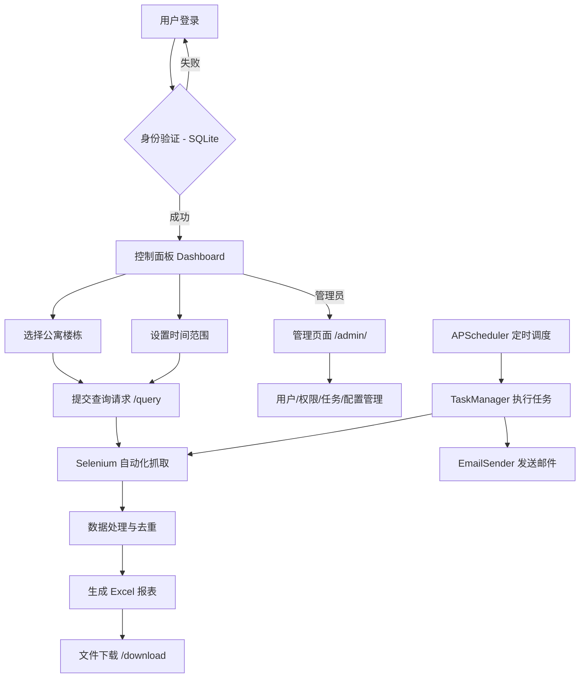

# edu-flask 项目说明文档

## 项目概述

**项目名称**: edu-flask
**项目类型**: 学生公寓晚归数据管理系统
**技术栈**: Flask + Selenium + openpyxl + SQLite + APScheduler
**主要功能**: 自动化收集、处理学生公寓晚归数据并生成 Excel 报表，支持定时自动查询并邮件发送

## 系统架构



## 目录结构

```
edu-flask/
├── app.py                      # Flask 主应用入口（集成调度器、注册 Blueprint）
├── log_config.py               # 日志配置模块
├── requirements.txt            # Python 依赖
├── restart.sh                  # 服务重启脚本
├── agent.md                    # 项目说明文档（本文件）
├── database/                   # 数据库模块
│   ├── __init__.py
│   ├── schema.sql             # 数据库表结构（提交 Git）
│   ├── init_data.sql          # 初始化数据（不提交，含敏感信息）
│   └── db.py                  # Database 类，封装所有 CRUD 操作
├── scheduler/                  # 定时任务模块
│   ├── __init__.py
│   ├── scheduler.py           # SchedulerManager 定时调度管理
│   ├── task_manager.py        # TaskManager 任务执行逻辑
│   └── email_sender.py        # EmailSender 邮件发送
├── routes/                     # 路由模块
│   ├── __init__.py
│   ├── auth.py                # login_required / admin_required 装饰器
│   └── admin.py               # 管理页面 Blueprint（/admin/ 路由）
├── templates/                  # HTML 模板目录
│   ├── login.html             # 登录页面
│   ├── dashboard.html         # 用户控制面板
│   └── admin.html             # 管理页面（6 个 Tab）
├── static/                     # 静态资源目录
│   ├── style.css              # 全局样式
│   ├── dashboard.css          # 控制面板样式
│   ├── login-background.jpg   # 登录页背景图
│   ├── dashboard-bg.jpg       # 控制面板背景图
│   └── dashboard-bg1.jpg      # 控制面板背景图备选
├── get_excel_data_curr/        # 核心数据处理模块
│   ├── __init__.py
│   ├── main.py                # 主处理流程（Selenium 抓取）
│   ├── gen_excel_data_v1.py   # Excel 生成模块
│   ├── ConfigTool.py          # 配置文件读取工具
│   ├── config.json            # 配置文件（仍被 Selenium 模块读取）
│   ├── t3.py                  # 数据获取辅助模块
│   └── get_building_ids.py    # 楼栋 ID 获取工具
├── data/                       # 数据目录（不提交）
│   └── edu.db                 # SQLite 数据库文件
├── result-files/               # 生成的报表文件存储目录
│   ├── admin/                 # admin 用户的文件
│   ├── lily/                  # lily 用户的文件
│   └── edu/                   # edu 用户的文件
├── docs/                       # 文档目录
│   ├── deployment.md          # 部署指南
│   └── auto_email_task_solution.md  # 自动邮件任务方案文档
├── backup/                     # 代码备份目录
└── plans/                      # 项目规划文档目录
    └── auto_email_task_plan.md
```

## 核心模块详解

### 1. Flask 主应用 (app.py)

**路由配置**:
- `GET/POST /login` - 用户登录页面
- `GET /dashboard` - 用户控制面板（需登录）
- `GET /logout` - 退出登录
- `GET /` - 首页
- `POST /query` - 数据查询接口（Ajax 请求）
- `GET /download/<path:filename>` - 文件下载接口
- `/admin/*` - 管理页面（通过 Blueprint 注册，需 admin 权限）

**用户认证**:
- 用户数据存储在 SQLite `users` 表中
- 登录时调用 `db.verify_user()` 验证用户名+密码+启用状态
- 基于 Flask session 的会话管理，存储 `username` 和 `role`
- Flask 密钥从 `.env` 的 `FLASK_SECRET_KEY` 读取

**集成功能**:
- 启动时初始化 `Database` 实例
- 注册 `admin_bp` Blueprint（管理页面路由）
- 启动 `SchedulerManager` 定时调度器

### 2. 数据抓取模块 (get_excel_data_curr/main.py)

**主要功能**:
- 使用 Selenium WebDriver 自动化登录天津科技大学公寓管理系统
- 目标 URL: `http://gytl.tust.edu.cn:8080/da-roadgate-resident/index`
- 支持无头模式（headless）运行
- 自动处理 Cookie 和会话管理

**处理流程**:
1. 日期验证（第 25-38 行）
2. Chrome WebDriver 配置（第 44-64 行）
3. 登录外部系统（第 66-96 行）
4. 获取楼栋数据（第 110-120 行）
5. 生成 Excel 文件（第 123 行）
6. 返回结果（第 134-137 行）

**配置项**:
- Chrome 二进制路径：从 config.json 读取
- ChromeDriver 路径：从 config.json 读取
- 无头模式、禁用 GPU、禁用沙箱等选项

### 3. 数据处理模块 (get_excel_data_curr/gen_excel_data_v1.py)

**核心算法 - 数据去重** (第 15-43 行):
```python
# 按学生 ID 分组
# 按打卡时间降序排序
# 保留每个学生最晚的一条记录
```

**Excel 生成流程** (第 57-157 行):
1. 创建新工作簿
2. 处理数据：添加楼栋前缀到房间号
3. 调用去重函数
4. 设置表头：日期、学院、学号、姓名、宿舍号、年级、培养层次、晚归时间
5. 填充数据行
6. 应用样式（对齐、边框、自适应列宽）
7. 保存文件到 `result-files/{username}/` 目录

**楼栋命名映射** (第 45-55 行):
- 1-10 栋：直接使用数字
- 11 栋 → 11A
- 12 栋 → 11B
- 13 栋 → 12A
- 14 栋 → 12B

### 4. 配置管理

**当前方案**：所有配置统一存储在 SQLite `system_config` 表中，通过管理页面在线修改。

| 配置项 | 说明 |
|--------|------|
| `tust_username` / `tust_password` | 公寓管理系统凭据 |
| `env` | 运行环境（test/prod） |
| `chrome_binary_path` / `chromedriver_path` | 浏览器路径 |
| `smtp_server` / `smtp_port` / `sender_email` / `sender_password` | SMTP 邮件配置 |
| `scheduler_enabled` / `scheduler_timezone` | 调度器配置 |
| `bid_dict` | 楼栋 ID 映射（JSON） |
| `data_cfg` | 学院名称映射（JSON） |

> **注意**：`get_excel_data_curr/ConfigTool.py` 仍从 `config.json` 和环境变量读取配置，尚未改造为读取数据库。

### 5. 数据库模块 (database/db.py)

`Database` 类封装所有数据库操作，初始化时自动执行 `schema.sql` 建表。

**5 张表**：`users`、`system_config`、`email_tasks`、`task_logs`、`permissions`

**核心方法**：
- `verify_user()` — 登录验证
- `get_config()` / `set_config()` — 系统配置读写
- 邮件任务 CRUD、任务日志记录、权限管理

### 6. 定时任务模块 (scheduler/)

- **SchedulerManager** (`scheduler.py`)：基于 APScheduler 的 BackgroundScheduler，为每个邮件任务创建 CronTrigger
- **TaskManager** (`task_manager.py`)：执行任务核心逻辑，调用 `process()` 生成 Excel → 发送邮件 → 记录日志
- **EmailSender** (`email_sender.py`)：SMTP 邮件发送，支持 TLS 和附件

### 7. 管理路由模块 (routes/)

- **admin.py**：Flask Blueprint（`url_prefix='/admin/'`），提供用户/权限/任务/配置/调度器的 REST API
- **auth.py**：`@login_required` 和 `@admin_required` 装饰器

### 8. 日志系统 (log_config.py)

**配置参数**:
- 日志文件：`edu.log`
- 最大大小：100MB
- 备份数量：5 个
- 日志格式：`时间 - 级别 - 消息`
- 日志级别：DEBUG

**特点**:
- 单例模式，防止重复配置
- 全局标志位 `_logging_configured`
- RotatingFileHandler 自动轮转

## 前端界面

### 登录页面 (templates/login.html)
- 用户名/密码表单
- Flash 消息显示
- 背景图：`login-background.jpg`

### 控制面板 (templates/dashboard.html)
- 楼栋多选框（14 个楼栋）
- 时间范围选择（开始时间、结束时间）
- 默认值：23:20:00 - 05:30:00
- 已选楼栋实时显示
- 提交按钮（异步请求）
- 文件下载链接
- 管理员用户显示「系统管理」入口链接

### 管理页面 (templates/admin.html)
6 个 Tab 页签：
- **邮件任务**：任务 CRUD + 手动触发执行
- **用户管理**：创建/编辑/删除/启用禁用用户
- **权限管理**：为用户分配 query/download/admin/trigger_task 权限
- **执行记录**：查看任务执行历史和状态
- **系统配置**：在线编辑所有系统配置项
- **调度器**：查看调度器状态、任务列表、重新加载

## API 接口

### POST /query
**请求体**:
```json
{
  "buildings": ["4", "5", "7"],
  "startTime": "23:20:00",
  "endTime": "05:30:00",
  "username": "admin"
}
```

**响应**:
```json
{
  "file_name": "result-files/admin/公寓学生晚归名单12.3.xlsx",
  "status": "success"
}
```

### GET /download/<path:filename>
**安全措施**: `safe_join()` 防路径遍历、文件存在性检查

### 管理 API（/admin/api/，需 admin 权限）

| 方法 | 路径 | 说明 |
|------|------|------|
| GET/POST | `/admin/api/users` | 用户列表/创建 |
| PUT/DELETE | `/admin/api/users/<username>` | 更新/删除用户 |
| GET/PUT | `/admin/api/permissions/<username>` | 获取/设置权限 |
| GET/POST | `/admin/api/email-tasks` | 任务列表/创建 |
| PUT/DELETE | `/admin/api/email-tasks/<id>` | 更新/删除任务 |
| POST | `/admin/api/trigger-task/<id>` | 手动触发任务 |
| GET | `/admin/api/task-logs` | 执行记录 |
| GET/PUT | `/admin/api/config` | 系统配置 |
| GET | `/admin/api/scheduler/status` | 调度器状态 |
| POST | `/admin/api/scheduler/reload` | 重新加载调度器 |

## 部署配置

**运行参数**:
- 主机：`0.0.0.0`（允许外部访问）
- 端口：`80`（HTTP 标准端口）
- 后台运行：支持 nohup

**数据存储**:
- 所有配置和用户数据存储在 `data/edu.db`（SQLite）
- `.env` 仅保留 `FLASK_SECRET_KEY`
- 详见 `docs/deployment.md`

**日志文件**:
- `edu.log` - 应用日志（轮转，最大 100MB）
- `out.log` - nohup 输出日志

## 业务流程

1. **用户登录**
   - 访问 `/login`
   - 输入用户名和密码
   - 验证通过后创建 session

2. **参数配置**
   - 进入 `/dashboard`
   - 选择目标楼栋（可多选）
   - 设置时间范围（默认晚归时段）

3. **数据抓取**
   - 提交表单触发 Ajax 请求到 `/query`
   - 后端启动 Selenium WebDriver
   - 自动登录外部系统
   - 按楼栋循环获取数据

4. **数据处理**
   - 按学生 ID 分组
   - 保留每个学生最晚的打卡记录
   - 格式化学院名称
   - 添加楼栋前缀到房间号

5. **报表生成**
   - 创建 Excel 工作簿
   - 设置表头和数据
   - 应用样式（对齐、边框、列宽）
   - 保存到用户目录

6. **结果下载**
   - 前端显示下载链接
   - 用户点击下载
   - 服务器安全传输文件

## 技术特点

### 优点
✅ **高度自动化**: 一键完成从数据抓取到报表生成  
✅ **智能去重**: 确保每个学生仅保留最晚记录  
✅ **用户友好**: 简洁的 Web 界面，实时反馈  
✅ **安全可靠**: 路径安全检查，完善的错误处理  
✅ **易于维护**: 配置文件化，详细的日志记录  
✅ **多用户支持**: 按用户分目录存储文件

### 已解决
✅ **密码硬编码** → 已迁移到 SQLite 数据库
✅ **密钥管理** → Flask secret key 从 `.env` 环境变量读取
✅ **依赖管理** → 已有 `requirements.txt`
✅ **权限控制** → 已实现用户角色和细粒度权限
✅ **定时任务** → 已实现自动查询+邮件发送

### 待改进
⚠️ **ConfigTool 改造**: `get_excel_data_curr/ConfigTool.py` 仍从 `config.json` 读取，未改为读数据库
⚠️ **错误处理**: 前端错误提示可以更友好
⚠️ **测试覆盖**: 缺少单元测试和集成测试
⚠️ **密码加密**: 用户密码目前明文存储，应使用哈希

## 依赖库

```
Flask>=2.0.0
selenium>=4.0.0
openpyxl>=3.0.0
python-dotenv>=1.0.0
requests>=2.28.0
APScheduler>=3.10.0
```

## 开发指南

### 本地运行
```bash
# 安装依赖
pip install -r requirements.txt

# 初始化数据库
mkdir -p data
sqlite3 data/edu.db < database/schema.sql
sqlite3 data/edu.db < database/init_data.sql

# 配置 .env
echo 'FLASK_SECRET_KEY=dev-secret-key' > .env

# 启动应用
python app.py
```

### 添加新用户
通过管理页面（`/admin/` → 用户管理 Tab）在线添加，或在 `database/init_data.sql` 中添加：
```sql
INSERT OR IGNORE INTO users (username, password, role) VALUES ('newuser', 'password', 'user');
```

### 修改系统配置
通过管理页面（`/admin/` → 系统配置 Tab）在线修改，或直接操作数据库：
```bash
sqlite3 data/edu.db "UPDATE system_config SET config_value='new_value' WHERE config_key='key';"
```

## 常见问题

### Q: 如何查看日志？
A: 查看 `edu.log` 文件，使用 `tail -f edu.log` 实时监控。

### Q: 如何重启服务？
A: 执行 `./restart.sh` 或手动杀死进程后重新运行 `python app.py`。

### Q: 为什么下载文件失败？
A: 检查 `result-files/` 目录权限，确保应用有写入权限。

### Q: Selenium 无法启动？
A: 检查 Chrome 和 ChromeDriver 版本是否匹配，路径配置是否正确。

### Q: 如何修改端口？
A: 修改 `app.py` 最后一行的 `port=80` 为其他端口。

## 更新日志

- **2026-02**: 新增自动邮件定时任务功能和后台管理页面
  - SQLite 数据库统一存储用户、配置、任务、日志、权限
  - APScheduler 定时调度，支持 Cron 表达式
  - 管理页面（6 个 Tab）：邮件任务、用户管理、权限管理、执行记录、系统配置、调度器
  - Flask Blueprint 路由分离
  - `.env` 精简为仅 `FLASK_SECRET_KEY`
- **2025-05-30**: 导出数据中只保留每个学生最晚打卡记录
- **2025-05-29**: 支持不同用户同时操作
- **初始版本**: 基础功能实现

## 联系方式

项目维护者：[请填写]
技术支持：[请填写]
