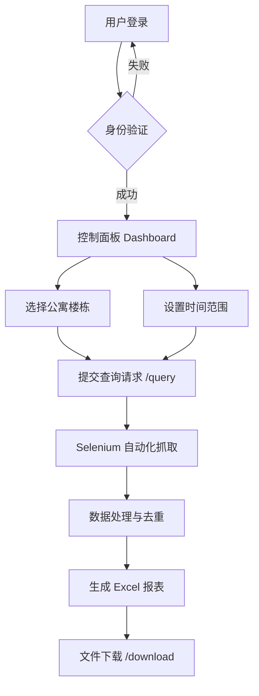

# edu-flask 项目说明文档

## 项目概述

**项目名称**: edu-flask  
**项目类型**: 学生公寓晚归数据管理系统  
**技术栈**: Flask + Selenium + openpyxl  
**主要功能**: 自动化收集、处理学生公寓晚归数据并生成 Excel 报表

## 系统架构



## 目录结构

```
edu-flask/
├── app.py                      # Flask 主应用入口
├── log_config.py               # 日志配置模块
├── edu.log                     # 应用日志文件
├── nohup.out                   # 后台运行输出日志
├── restart.sh                  # 服务重启脚本
├── agent.md                    # 项目说明文档（本文件）
├── templates/                  # HTML 模板目录
│   ├── login.html             # 登录页面
│   └── dashboard.html         # 用户控制面板
├── static/                     # 静态资源目录
│   ├── style.css              # 全局样式
│   ├── dashboard.css          # 控制面板样式
│   ├── login-background.jpg   # 登录页背景图
│   ├── dashboard-bg.jpg       # 控制面板背景图
│   └── dashboard-bg1.jpg      # 控制面板背景图备选
├── get_excel_data_curr/        # 核心数据处理模块
│   ├── __init__.py
│   ├── main.py                # 主处理流程（Selenium 抓取）
│   ├── gen_excel_data_v1.py   # Excel 生成模块
│   ├── ConfigTool.py          # 配置文件读取工具
│   ├── config.json            # 配置文件
│   ├── t3.py                  # 数据获取辅助模块
│   └── get_building_ids.py    # 楼栋 ID 获取工具
├── result-files/               # 生成的报表文件存储目录
│   ├── admin/                 # admin 用户的文件
│   ├── lily/                  # lily 用户的文件
│   └── edu/                   # edu 用户的文件
├── backup/                     # 代码备份目录
└── plans/                      # 项目规划文档目录
    └── auto_email_task_plan.md
```

## 核心模块详解

### 1. Flask 主应用 (app.py)

**路由配置**:
- `GET/POST /login` - 用户登录页面
- `GET /dashboard` - 用户控制面板（需登录）
- `GET /logout` - 退出登录
- `GET /` - 首页（简单问候）
- `POST /query` - 数据查询接口（Ajax 请求）
- `GET /download/<path:filename>` - 文件下载接口

**用户认证**:
- 硬编码用户字典：`{'admin': 'admin123', 'lily': 'lily2025'}`
- 基于 Flask session 的会话管理
- 密钥：`your_secret_key`（生产环境需更换）

**关键代码位置**:
- 用户数据定义：第 21-24 行
- 登录逻辑：第 28-55 行
- 查询处理：第 89-98 行
- 文件下载：第 101-118 行

### 2. 数据抓取模块 (get_excel_data_curr/main.py)

**主要功能**:
- 使用 Selenium WebDriver 自动化登录天津科技大学公寓管理系统
- 目标 URL: `http://gytl.tust.edu.cn:8080/da-roadgate-resident/index`
- 支持无头模式（headless）运行
- 自动处理 Cookie 和会话管理

**处理流程**:
1. 日期验证（第 25-38 行）
2. Chrome WebDriver 配置（第 44-64 行）
3. 登录外部系统（第 66-96 行）
4. 获取楼栋数据（第 110-120 行）
5. 生成 Excel 文件（第 123 行）
6. 返回结果（第 134-137 行）

**配置项**:
- Chrome 二进制路径：从 config.json 读取
- ChromeDriver 路径：从 config.json 读取
- 无头模式、禁用 GPU、禁用沙箱等选项

### 3. 数据处理模块 (get_excel_data_curr/gen_excel_data_v1.py)

**核心算法 - 数据去重** (第 15-43 行):
```python
# 按学生 ID 分组
# 按打卡时间降序排序
# 保留每个学生最晚的一条记录
```

**Excel 生成流程** (第 57-157 行):
1. 创建新工作簿
2. 处理数据：添加楼栋前缀到房间号
3. 调用去重函数
4. 设置表头：日期、学院、学号、姓名、宿舍号、年级、培养层次、晚归时间
5. 填充数据行
6. 应用样式（对齐、边框、自适应列宽）
7. 保存文件到 `result-files/{username}/` 目录

**楼栋命名映射** (第 45-55 行):
- 1-10 栋：直接使用数字
- 11 栋 → 11A
- 12 栋 → 11B
- 13 栋 → 12A
- 14 栋 → 12B

### 4. 配置管理 (get_excel_data_curr/config.json)

**配置项说明**:
```json
{
  "username": "外部系统登录用户名",
  "password": "外部系统登录密码",
  "beginTime": "晚归开始时间（默认 23:20:00）",
  "endTime": "晚归结束时间（默认 05:30:00）",
  "flag": "授权标志",
  "binary_location": "Chrome 浏览器路径",
  "driver_location": "ChromeDriver 路径",
  "pagesize": "分页大小",
  "data_cfg": {
    "学院全称": "报表中显示的简称"
  },
  "bid_dict": {
    "楼栋编号": "楼栋 ID（用于 API 请求）"
  }
}
```

### 5. 日志系统 (log_config.py)

**配置参数**:
- 日志文件：`edu.log`
- 最大大小：100MB
- 备份数量：5 个
- 日志格式：`时间 - 级别 - 消息`
- 日志级别：DEBUG

**特点**:
- 单例模式，防止重复配置
- 全局标志位 `_logging_configured`
- RotatingFileHandler 自动轮转

## 前端界面

### 登录页面 (templates/login.html)
- 用户名/密码表单
- Flash 消息显示
- 背景图：`login-background.jpg`

### 控制面板 (templates/dashboard.html)
- 楼栋多选框（14 个楼栋）
- 时间范围选择（开始时间、结束时间）
- 默认值：23:20:00 - 05:30:00
- 已选楼栋实时显示
- 提交按钮（异步请求）
- 文件下载链接

**JavaScript 功能**:
- 默认选中 4、5、7 栋（第 83-96 行）
- Ajax 提交查询（第 98-152 行）
- 表单重置（第 154-161 行）
- 楼栋名称转换显示（第 174-186 行）

## API 接口

### POST /query
**请求体**:
```json
{
  "buildings": ["4", "5", "7"],
  "startTime": "23:20:00",
  "endTime": "05:30:00",
  "username": "admin"
}
```

**响应**:
```json
{
  "file_name": "result-files/admin/公寓学生晚归名单12.3.xlsx",
  "status": "success"
}
```

### GET /download/<path:filename>
**示例**: `/download/result-files/admin/公寓学生晚归名单12.3.xlsx`

**安全措施**:
- 使用 `safe_join()` 防止路径遍历攻击
- 移除重复的目录名
- 文件存在性检查

## 部署配置

**运行参数**:
- 主机：`0.0.0.0`（允许外部访问）
- 端口：`80`（HTTP 标准端口）
- 后台运行：支持 nohup

**重启脚本** (restart.sh):
```bash
#!/bin/bash
# 查找并杀死旧进程
# 启动新进程
```

**日志文件**:
- `edu.log` - 应用日志（轮转，最大 100MB）
- `nohup.out` - nohup 输出日志
- `out.log` - 其他输出日志

## 业务流程

1. **用户登录**
   - 访问 `/login`
   - 输入用户名和密码
   - 验证通过后创建 session

2. **参数配置**
   - 进入 `/dashboard`
   - 选择目标楼栋（可多选）
   - 设置时间范围（默认晚归时段）

3. **数据抓取**
   - 提交表单触发 Ajax 请求到 `/query`
   - 后端启动 Selenium WebDriver
   - 自动登录外部系统
   - 按楼栋循环获取数据

4. **数据处理**
   - 按学生 ID 分组
   - 保留每个学生最晚的打卡记录
   - 格式化学院名称
   - 添加楼栋前缀到房间号

5. **报表生成**
   - 创建 Excel 工作簿
   - 设置表头和数据
   - 应用样式（对齐、边框、列宽）
   - 保存到用户目录

6. **结果下载**
   - 前端显示下载链接
   - 用户点击下载
   - 服务器安全传输文件

## 技术特点

### 优点
✅ **高度自动化**: 一键完成从数据抓取到报表生成  
✅ **智能去重**: 确保每个学生仅保留最晚记录  
✅ **用户友好**: 简洁的 Web 界面，实时反馈  
✅ **安全可靠**: 路径安全检查，完善的错误处理  
✅ **易于维护**: 配置文件化，详细的日志记录  
✅ **多用户支持**: 按用户分目录存储文件

### 待改进
⚠️ **密码硬编码**: 用户密码应迁移到数据库  
⚠️ **密钥管理**: Flask secret key 应使用环境变量  
⚠️ **错误处理**: 前端错误提示可以更友好  
⚠️ **测试覆盖**: 缺少单元测试和集成测试  
⚠️ **依赖管理**: 缺少 requirements.txt

## 依赖库

```
Flask>=2.0.0
selenium>=4.0.0
openpyxl>=3.0.0
```

## 开发指南

### 本地运行
```bash
# 安装依赖
pip install flask selenium openpyxl

# 配置 Chrome 和 ChromeDriver
# 修改 get_excel_data_curr/config.json

# 启动应用
python app.py
```

### 添加新用户
在 `app.py` 的 `users` 字典中添加：
```python
users = {
    'admin': 'admin123',
    'lily': 'lily2025',
    'newuser': 'newpassword',  # 添加新用户
}
```

### 修改楼栋配置
编辑 `get_excel_data_curr/config.json` 中的 `bid_dict`：
```json
"bid_dict": {
  "1": "楼栋1的ID",
  "2": "楼栋2的ID",
  ...
}
```

### 修改学院名称映射
编辑 `get_excel_data_curr/config.json` 中的 `data_cfg`：
```json
"data_cfg": {
  "人工智能学院": "人工智能学院",
  "理学院": "理学院",
  ...
}
```

## 常见问题

### Q: 如何查看日志？
A: 查看 `edu.log` 文件，使用 `tail -f edu.log` 实时监控。

### Q: 如何重启服务？
A: 执行 `./restart.sh` 或手动杀死进程后重新运行 `python app.py`。

### Q: 为什么下载文件失败？
A: 检查 `result-files/` 目录权限，确保应用有写入权限。

### Q: Selenium 无法启动？
A: 检查 Chrome 和 ChromeDriver 版本是否匹配，路径配置是否正确。

### Q: 如何修改端口？
A: 修改 `app.py` 最后一行的 `port=80` 为其他端口。

## 更新日志

- **2025-05-30**: 导出数据中只保留每个学生最晚打卡记录
- **2025-05-29**: 支持不同用户同时操作
- **初始版本**: 基础功能实现

## 联系方式

项目维护者：[请填写]
技术支持：[请填写]
