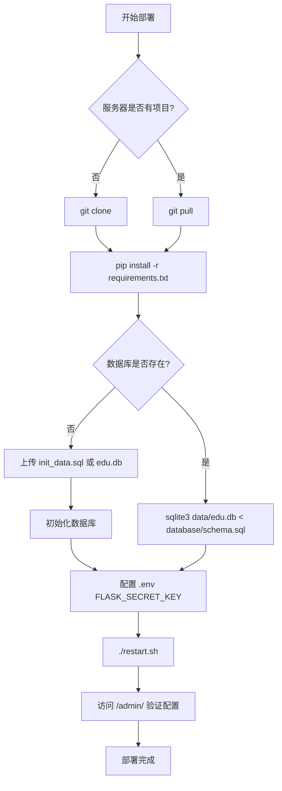

# edu-flask 服务器部署指南

## 目录

- [环境要求](#环境要求)
- [配置文件说明](#配置文件说明)
- [全新部署](#全新部署)
- [更新部署](#更新部署)
- [验证部署](#验证部署)
- [常见问题](#常见问题)

---

## 环境要求

| 软件 | 版本 | 说明 |
|------|------|------|
| Python | 3.8+ | 推荐使用 Python 3.9 |
| Chrome | 最新版 | Selenium 自动化需要 |
| ChromeDriver | 与 Chrome 版本匹配 | Selenium 驱动 |
| SQLite | 3.x | Python 自带，无需额外安装 |

## 配置文件说明

项目使用 **SQLite 数据库** 统一管理所有配置和用户数据，`.env` 仅保留 Flask 密钥。

| 文件 | Git 状态 | 说明 |
|------|----------|------|
| `.env` | ❌ 忽略 | 仅存放 `FLASK_SECRET_KEY` |
| `database/schema.sql` | ✅ 已提交 | 数据库表结构（建表语句） |
| `database/init_data.sql` | ❌ 忽略 | 初始化数据（含密码等敏感信息） |
| `data/edu.db` | ❌ 忽略 | SQLite 数据库文件 |

### 数据库中存储的配置

所有原来分散在 `.env` 和 `config.json` 中的配置，现在统一存储在 `system_config` 表中：

| 配置项 | 说明 | 示例值 |
|--------|------|--------|
| `tust_username` / `tust_password` | 公寓管理系统凭据 | `27011228` |
| `env` | 运行环境 | `prod` / `test` |
| `chrome_binary_path` / `chromedriver_path` | 浏览器路径（空值=自动管理） | `/opt/google/chrome/chrome` |
| `smtp_server` / `smtp_port` / `sender_email` / `sender_password` | 邮件 SMTP 配置 | `smtp.163.com` |
| `flag` | 系统标识 | `whosyourdady` |
| `scheduler_enabled` / `scheduler_timezone` | 定时调度器配置 | `true` / `Asia/Shanghai` |
| `bid_dict` | 楼栋 ID 映射（JSON） | `{"1":"7d67..."}` |
| `data_cfg` | 学院名称映射（JSON） | `{"人工智能学院":"人工智能学院"}` |

> 所有配置均可通过管理页面（`/admin/`）在线修改，无需登录服务器。

---

## 全新部署

### 步骤 1：克隆代码

```bash
ssh user@your-server-ip
git clone https://github.com/widy21/tianjin-edu.git
cd tianjin-edu
```

### 步骤 2：安装依赖

```bash
pip3 install -r requirements.txt
```

### 步骤 3：初始化数据库

有两种方式，任选其一：

**方式 A：执行 SQL 文件初始化（推荐首次部署）**

先将本地的 `database/init_data.sql` 上传到服务器，然后执行：

```bash
# 在本地执行上传
scp database/init_data.sql user@your-server-ip:/path/to/tianjin-edu/database/

# 在服务器上执行初始化
mkdir -p data
sqlite3 data/edu.db < database/schema.sql
sqlite3 data/edu.db < database/init_data.sql
```

**方式 B：直接上传数据库文件（推荐已有数据时）**

```bash
# 在本地执行，将已配置好的数据库直接上传
scp data/edu.db user@your-server-ip:/path/to/tianjin-edu/data/
```

### 步骤 4：配置 .env

```bash
# 在服务器上创建 .env，仅需一行
echo 'FLASK_SECRET_KEY=your_very_long_random_secret_key_here' > .env

# 生成随机密钥的方法：
python3 -c "import secrets; print('FLASK_SECRET_KEY=' + secrets.token_hex(32))" > .env
```

### 步骤 5：启动服务

```bash
chmod +x restart.sh
./restart.sh
```

### 步骤 6：验证并配置

1. 浏览器访问 `http://your-server-ip/login`，使用 admin 账号登录
2. 访问 `http://your-server-ip/admin/`，检查系统配置是否正确
3. 在管理页面修改 SMTP 邮件配置（发件人邮箱和授权码）
4. 如需定时任务，在管理页面启用调度器（`scheduler_enabled` 改为 `true`）并重新加载

---

## 更新部署

当项目有更新时：

```bash
# 1. 进入项目目录
cd /path/to/tianjin-edu

# 2. 拉取最新代码
git pull

# 3. 安装新依赖（如有）
pip3 install -r requirements.txt

# 4. 更新数据库表结构（安全操作，不会丢失数据）
sqlite3 data/edu.db < database/schema.sql

# 5. 重启服务
./restart.sh
```

> **注意**：`schema.sql` 使用 `CREATE TABLE IF NOT EXISTS`，重复执行不会影响已有数据。

---

## 验证部署

### 检查服务状态

```bash
# 查看启动日志
tail -f out.log

# 检查进程是否运行
ps -ef | grep app.py

# 检查端口监听
netstat -tlnp | grep :80
```

### 检查数据库

```bash
# 确认数据库文件存在
ls -la data/edu.db

# 检查用户数据
sqlite3 data/edu.db "SELECT username, role, enabled FROM users;"

# 检查系统配置
sqlite3 data/edu.db "SELECT config_key, substr(config_value, 1, 40) FROM system_config;"
```

### 测试访问

```bash
# 本地测试
curl http://localhost:80/login

# 浏览器访问
http://your-server-ip/login

# 管理页面（需 admin 账号登录）
http://your-server-ip/admin/
```

---

## 常见问题

### Q1: 启动失败，提示模块找不到

```bash
# 检查 Python 版本
python3 --version

# 重新安装依赖
pip3 install -r requirements.txt
```

### Q2: Selenium 无法启动 Chrome

```bash
# 检查 Chrome 是否安装
google-chrome --version

# 检查 ChromeDriver 版本是否匹配
chromedriver --version

# 如果版本不匹配，下载对应版本
# https://chromedriver.chromium.org/downloads
```

### Q3: 端口 80 被占用

```bash
# 查看占用端口的进程
netstat -tlnp | grep :80

# 杀掉占用进程
kill -9 <PID>
```

### Q4: 数据库相关问题

**数据库文件不存在：**
```bash
mkdir -p data
sqlite3 data/edu.db < database/schema.sql
sqlite3 data/edu.db < database/init_data.sql
```

**表结构需要更新（拉取新代码后）：**
```bash
sqlite3 data/edu.db < database/schema.sql
```

**需要重置数据库：**
```bash
rm data/edu.db
sqlite3 data/edu.db < database/schema.sql
sqlite3 data/edu.db < database/init_data.sql
```

### Q5: 如何查看运行日志

```bash
# 实时查看日志
tail -f out.log

# 查看应用日志
tail -f edu.log

# 查看最近 100 行
tail -n 100 out.log
```

---

## 部署流程图



---

## 联系方式

如有问题，请联系项目维护者。
