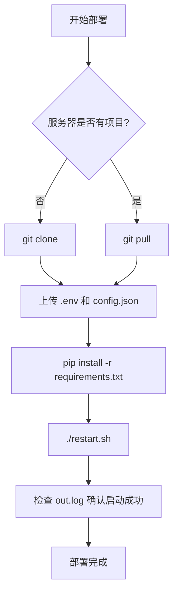

# edu-flask 服务器部署指南

## 目录

- [环境要求](#环境要求)
- [全新部署](#全新部署)
- [更新部署](#更新部署)
- [验证部署](#验证部署)
- [常见问题](#常见问题)

---

## 环境要求

| 软件 | 版本 | 说明 |
|------|------|------|
| Python | 3.8+ | 推荐使用 Python 3.9 |
| Chrome | 最新版 | Selenium 自动化需要 |
| ChromeDriver | 与 Chrome 版本匹配 | Selenium 驱动 |

## 配置文件说明

| 文件 | Git 状态 | 说明 |
|------|----------|------|
| `.env` | 忽略 | 敏感配置（密码、密钥）|
| `get_excel_data_curr/config.json` | 忽略 | 完整配置文件 |
| `.env.example` | 已提交 | 环境变量模板 |
| `config.json.example` | 已提交 | 配置文件模板 |

**重要**：`python-dotenv` 会自动读取 `.env` 文件，无需手动 `export` 环境变量。

---

## 全新部署

### 步骤 1：服务器上克隆代码

```bash
# SSH 登录服务器
ssh user@your-server-ip

# 克隆代码
git clone https://github.com/widy21/tianjin-edu.git
cd tianjin-edu
```

### 步骤 2：上传敏感配置文件

**在本地电脑执行**：

```bash
# 上传 .env 文件
scp .env user@your-server-ip:/path/to/tianjin-edu/.env

# 上传 config.json 文件
scp get_excel_data_curr/config.json user@your-server-ip:/path/to/tianjin-edu/get_excel_data_curr/config.json
```

### 步骤 3：安装依赖

```bash
# 在服务器上执行
pip3 install -r requirements.txt
```

### 步骤 4：启动服务

```bash
# 添加执行权限
chmod +x restart.sh

# 启动服务
./restart.sh
```

---

## 更新部署

当项目有更新时，执行以下步骤：

```bash
# 1. 进入项目目录
cd /path/to/tianjin-edu

# 2. 拉取最新代码
git pull

# 3. 安装新依赖（如有）
pip3 install -r requirements.txt

# 4. 重启服务
./restart.sh
```

---

## 验证部署

### 检查服务状态

```bash
# 查看启动日志
tail -f out.log

# 检查进程是否运行
ps -ef | grep app.py

# 检查端口监听
netstat -tlnp | grep :80
```

### 测试访问

```bash
# 本地测试
curl http://localhost:80/login

# 浏览器访问
http://your-server-ip/login
```

---

## 常见问题

### Q1: 启动失败，提示模块找不到

```bash
# 检查 Python 版本
python3 --version

# 重新安装依赖
pip3 install -r requirements.txt
```

### Q2: Selenium 无法启动 Chrome

```bash
# 检查 Chrome 是否安装
google-chrome --version

# 检查 ChromeDriver 版本是否匹配
chromedriver --version

# 如果版本不匹配，下载对应版本
# https://chromedriver.chromium.org/downloads
```

### Q3: 端口 80 被占用

```bash
# 查看占用端口的进程
netstat -tlnp | grep :80

# 杀掉占用进程
kill -9 <PID>
```

### Q4: .env 文件没有生效

确保：
1. `.env` 文件在项目根目录
2. 文件格式正确（`KEY=VALUE`，无空格）
3. 代码中已调用 `load_dotenv()`

### Q5: 如何查看运行日志

```bash
# 实时查看日志
tail -f out.log

# 查看应用日志
tail -f edu.log

# 查看最近 100 行
tail -n 100 out.log
```

---

## 部署流程图



---

## 联系方式

如有问题，请联系项目维护者。
