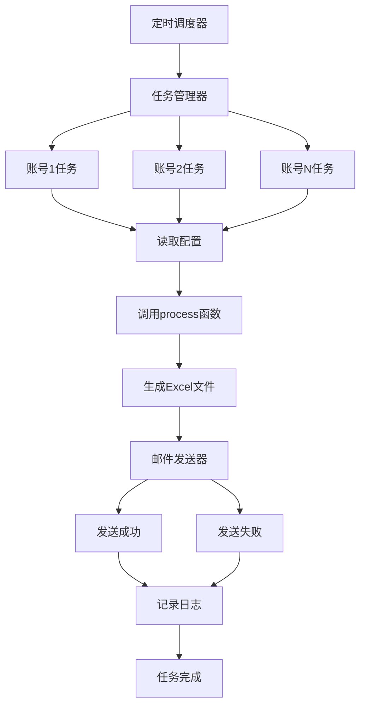
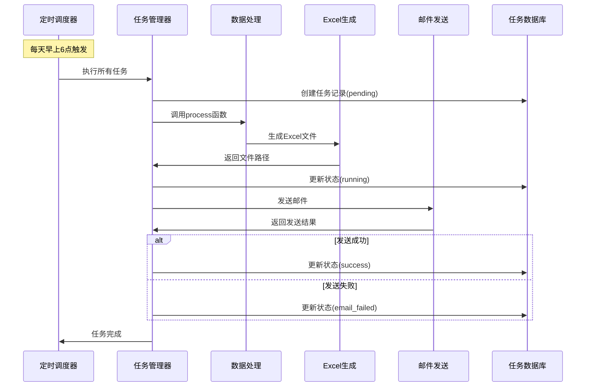

# 自动邮件发送任务实施方案

## 一、需求概述

为现有公寓学生晚归管理系统添加定时任务功能，每天自动根据账号和配置信息执行查询、下载，并通过邮件发送 Excel 文件。

---

## 二、功能需求

### 2.1 核心功能
1. **定时任务调度**：每天固定时间自动执行
2. **多账号支持**：为不同账号配置不同的楼栋信息
3. **自动查询**：调用现有的 `process()` 函数生成 Excel 文件
4. **邮件发送**：将生成的 Excel 文件作为附件发送
5. **状态记录**：记录任务执行状态和结果

### 2.2 配置需求
- 每个账号对应的楼栋列表
- 每个账号对应的收件人邮箱
- 查询时间段配置
- 邮件服务器配置
- 任务执行时间配置

---

## 三、技术方案

### 3.1 整体架构



### 3.2 技术选型

| 组件 | 技术方案 | 说明 |
|------|----------|------|
| 定时调度 | **APScheduler** | Python 原生，功能强大，支持持久化 |
| 邮件发送 | **smtplib + email** | Python 标准库，无需额外依赖 |
| 配置管理 | 扩展现有 JSON 配置 | 保持一致性 |
| 日志记录 | 使用现有 logging | 统一日志管理 |
| 任务状态 | SQLite 数据库 | 轻量级，易于管理 |

---

## 四、详细设计

### 4.1 文件结构

```
edu-flask/
├── app.py                          # 主应用（保持不变）
├── get_excel_data_curr/
│   ├── main.py                     # 数据处理核心（保持不变）
│   ├── ConfigTool.py               # 配置工具（扩展）
│   ├── config.json                 # 配置文件（扩展）
│   └── ...
├── scheduler/                      # 新增：定时任务模块
│   ├── __init__.py
│   ├── scheduler.py               # 定时调度器
│   ├── task_manager.py            # 任务管理器
│   └── email_sender.py            # 邮件发送器
├── tasks.db                        # 新增：任务状态数据库
├── log_config.py                   # 日志配置（保持不变）
└── plans/
    └── auto_email_task_plan.md     # 本方案文档
```

### 4.2 配置文件扩展

#### 扩展 `config.json`

```json
{
  "env": "test",
  "username": "27011228",
  "password": "123123",
  "beginTime": "23:20:00",
  "endTime": "05:30:00",
  "flag": "true",
  "binary_location_prod": "/opt/google/chrome/chrome",
  "driver_location_prod": "/usr/local/bin/chromedriver",
  "binary_location_test": "",
  "driver_location_test": "",
  "pagesize": 20,
  "data_cfg": {
    "人工智能学院": "人工智能学院",
    "理学院": "理学院",
    "电子信息与自动化学院": "电信学院",
    "经济与管理学院": "经管学院",
    "马克思主义学院": "马院",
    "理想学院": "dream学院",
    "外国语学院": "外国语学院"
  },
  "bid_dict": {
    "1": "7d6716cae1ce1ce062af12d9ddbe7798",
    "2": "7e994f8176dbd4a52c25794b1c14a1f3",
    "3": "d25c14ad59fe9972a5c763a0ebbe5eae",
    "4": "96a9f706e3826df71d073fce0eb6fb4a",
    "5": "2f9d3d8e04a3110b2e303efc996a111d",
    "6": "eb73cc1d4a0e6dc28eb8c25336bf248e",
    "7": "8edd444106ef2669494b33f1984f6a76",
    "8": "d3efaaf7113f226596411db1935bfbc9",
    "9": "99c36d89960714c4c232f65c1e46d2c6",
    "10": "0c395dfa5a2b85dd9d2df7746705721c",
    "11": "83b331d588ea32c0d6a9e58c4dd99e32",
    "12": "5ca6425134fad4ba753dbb355e7c590d",
    "13": "80400e76981c330b0d2e59c2c240236f",
    "14": "5656779b448195dec3e809ab0f7e9f19",
    "15": "000299ae644a2cee43bcb34c23909679",
    "16": "6a8893dfc2ac6bb00da3807e10c11d8f",
    "17": "f83e242894851bdff1f252b15d2e7058",
    "18": "29f75988510ffd48a43f59f8c7db3f68",
    "19": "c25b2059afb0e9d3cf9605df56e71a6a",
    "20": "6a9716506e006f15ba93d86d006ceda2"
  },
  
  // ========== 新增配置项 ==========
  
  // 邮件服务器配置
  "email_config": {
    "smtp_server": "smtp.qq.com",
    "smtp_port": 587,
    "sender_email": "your_email@qq.com",
    "sender_password": "your_password",
    "use_tls": true
  },
  
  // 定时任务配置
  "scheduler_config": {
    "enabled": true,
    "cron_expression": "0 6 * * *",  // 每天早上6点执行
    "timezone": "Asia/Shanghai"
  },
  
  // 账号任务配置
  "account_tasks": [
    {
      "username": "admin",
      "enabled": true,
      "buildings": ["1", "2", "3", "4", "5"],
      "recipients": ["admin1@tust.edu.cn", "admin2@tust.edu.cn"],
      "subject_prefix": "【公寓晚归】",
      "custom_time": {
        "startTime": "23:20:00",
        "endTime": "05:30:00"
      }
    },
    {
      "username": "lily",
      "enabled": true,
      "buildings": ["6", "7", "8", "9", "10"],
      "recipients": ["lily@tust.edu.cn"],
      "subject_prefix": "【晚归名单】",
      "custom_time": {
        "startTime": "23:00:00",
        "endTime": "05:00:00"
      }
    },
    {
      "username": "edu",
      "enabled": true,
      "buildings": ["11", "12", "13", "14", "15"],
      "recipients": ["edu@tust.edu.cn", "dean@tust.edu.cn"],
      "subject_prefix": "【学生晚归】",
      "custom_time": null  // 使用全局默认时间
    }
  ]
}
```

### 4.3 核心模块设计

#### 4.3.1 邮件发送器 (`scheduler/email_sender.py`)

```python
import smtplib
from email.mime.multipart import MIMEMultipart
from email.mime.text import MIMEText
from email.mime.application import MIMEApplication
import logging
from datetime import datetime

class EmailSender:
    def __init__(self, config):
        self.smtp_server = config['smtp_server']
        self.smtp_port = config['smtp_port']
        self.sender_email = config['sender_email']
        self.sender_password = config['sender_password']
        self.use_tls = config.get('use_tls', True)
        self.logger = logging.getLogger(__name__)
    
    def send_email(self, recipients, subject, body, attachments=None):
        """发送邮件"""
        try:
            # 创建邮件对象
            msg = MIMEMultipart()
            msg['From'] = self.sender_email
            msg['To'] = ', '.join(recipients)
            msg['Subject'] = subject
            
            # 添加正文
            msg.attach(MIMEText(body, 'plain', 'utf-8'))
            
            # 添加附件
            if attachments:
                for file_path in attachments:
                    with open(file_path, 'rb') as f:
                        part = MIMEApplication(f.read(), Name=file_path)
                        part['Content-Disposition'] = f'attachment; filename="{file_path.split("/")[-1]}"'
                        msg.attach(part)
            
            # 连接SMTP服务器并发送
            with smtplib.SMTP(self.smtp_server, self.smtp_port) as server:
                if self.use_tls:
                    server.starttls()
                server.login(self.sender_email, self.sender_password)
                server.send_message(msg)
            
            self.logger.info(f"邮件发送成功: {recipients}")
            return True, "邮件发送成功"
        
        except Exception as e:
            self.logger.error(f"邮件发送失败: {str(e)}")
            return False, str(e)
```

#### 4.3.2 任务管理器 (`scheduler/task_manager.py`)

```python
import logging
from datetime import datetime
from get_excel_data_curr.main import process
from scheduler.email_sender import EmailSender
from scheduler.task_db import TaskDB

class TaskManager:
    def __init__(self, config, email_sender, task_db):
        self.config = config
        self.email_sender = email_sender
        self.task_db = task_db
        self.logger = logging.getLogger(__name__)
    
    def execute_account_task(self, account_config):
        """执行单个账号的任务"""
        username = account_config['username']
        task_id = self.task_db.create_task(username, 'pending')
        
        try:
            self.logger.info(f"开始执行任务: {username}")
            self.task_db.update_task(task_id, 'running')
            
            # 准备请求数据
            request_data = {
                'buildings': account_config['buildings'],
                'username': username,
                'startTime': account_config.get('custom_time', {}).get('startTime') or self.config['beginTime'],
                'endTime': account_config.get('custom_time', {}).get('endTime') or self.config['endTime']
            }
            
            # 调用 process 函数生成 Excel
            result = process(request_data)
            
            if result['status'] == 'success':
                file_path = result['file_name']
                
                # 发送邮件
                recipients = account_config['recipients']
                subject = f"{account_config.get('subject_prefix', '')}{username} - {datetime.now().strftime('%Y-%m-%d')}"
                body = f"""
尊敬的用户：

附件是 {username} 账号的公寓学生晚归名单。

生成时间：{datetime.now().strftime('%Y-%m-%d %H:%M:%S')}
查询楼栋：{', '.join(account_config['buildings'])}

如有问题，请联系管理员。

此邮件由系统自动发送，请勿回复。
"""
                
                success, message = self.email_sender.send_email(
                    recipients=recipients,
                    subject=subject,
                    body=body,
                    attachments=[file_path]
                )
                
                if success:
                    self.task_db.update_task(task_id, 'success', file_path=file_path)
                    self.logger.info(f"任务执行成功: {username}")
                else:
                    self.task_db.update_task(task_id, 'email_failed', error_message=message)
                    self.logger.error(f"邮件发送失败: {username} - {message}")
            else:
                self.task_db.update_task(task_id, 'failed', error_message=result.get('msg', '未知错误'))
                self.logger.error(f"数据查询失败: {username} - {result.get('msg')}")
        
        except Exception as e:
            self.task_db.update_task(task_id, 'failed', error_message=str(e))
            self.logger.error(f"任务执行异常: {username} - {str(e)}")
    
    def execute_all_tasks(self):
        """执行所有启用的账号任务"""
        account_tasks = self.config.get('account_tasks', [])
        
        for account_config in account_tasks:
            if account_config.get('enabled', True):
                self.execute_account_task(account_config)
```

#### 4.3.3 定时调度器 (`scheduler/scheduler.py`)

```python
from apscheduler.schedulers.background import BackgroundScheduler
from apscheduler.triggers.cron import CronTrigger
import logging
from scheduler.task_manager import TaskManager
from scheduler.email_sender import EmailSender
from scheduler.task_db import TaskDB
from get_excel_data_curr.ConfigTool import ConfigTool

class SchedulerManager:
    def __init__(self):
        self.logger = logging.getLogger(__name__)
        self.scheduler = None
        self.config_tool = ConfigTool("./get_excel_data_curr/config.json")
    
    def start(self):
        """启动定时调度器"""
        try:
            scheduler_config = self.config_tool.get_scheduler_config()
            
            if not scheduler_config.get('enabled', False):
                self.logger.info("定时任务未启用")
                return
            
            # 创建调度器
            self.scheduler = BackgroundScheduler(timezone=scheduler_config.get('timezone', 'Asia/Shanghai'))
            
            # 解析 cron 表达式
            cron_expr = scheduler_config.get('cron_expression', '0 6 * * *')
            parts = cron_expr.split()
            if len(parts) == 5:
                minute, hour, day, month, day_of_week = parts
            else:
                # 默认每天早上6点
                minute, hour, day, month, day_of_week = '0', '6', '*', '*', '*'
            
            # 初始化任务管理器
            email_config = self.config_tool.get_email_config()
            email_sender = EmailSender(email_config)
            task_db = TaskDB('tasks.db')
            task_manager = TaskManager(self.config_tool.config, email_sender, task_db)
            
            # 添加定时任务
            self.scheduler.add_job(
                func=task_manager.execute_all_tasks,
                trigger=CronTrigger(
                    minute=minute,
                    hour=hour,
                    day=day,
                    month=month,
                    day_of_week=day_of_week
                ),
                id='daily_email_task',
                name='每日邮件发送任务',
                replace_existing=True
            )
            
            # 启动调度器
            self.scheduler.start()
            self.logger.info(f"定时调度器已启动，执行时间: {cron_expr}")
        
        except Exception as e:
            self.logger.error(f"启动调度器失败: {str(e)}")
    
    def stop(self):
        """停止调度器"""
        if self.scheduler and self.scheduler.running:
            self.scheduler.shutdown()
            self.logger.info("定时调度器已停止")
```

#### 4.3.4 任务数据库 (`scheduler/task_db.py`)

```python
import sqlite3
from datetime import datetime
import logging

class TaskDB:
    def __init__(self, db_path):
        self.db_path = db_path
        self.logger = logging.getLogger(__name__)
        self._init_db()
    
    def _init_db(self):
        """初始化数据库"""
        conn = sqlite3.connect(self.db_path)
        cursor = conn.cursor()
        
        cursor.execute('''
            CREATE TABLE IF NOT EXISTS tasks (
                id INTEGER PRIMARY KEY AUTOINCREMENT,
                username TEXT NOT NULL,
                status TEXT NOT NULL,
                file_path TEXT,
                error_message TEXT,
                created_at TIMESTAMP DEFAULT CURRENT_TIMESTAMP,
                updated_at TIMESTAMP DEFAULT CURRENT_TIMESTAMP
            )
        ''')
        
        conn.commit()
        conn.close()
    
    def create_task(self, username, status='pending'):
        """创建任务记录"""
        conn = sqlite3.connect(self.db_path)
        cursor = conn.cursor()
        
        cursor.execute('''
            INSERT INTO tasks (username, status)
            VALUES (?, ?)
        ''', (username, status))
        
        task_id = cursor.lastrowid
        conn.commit()
        conn.close()
        
        return task_id
    
    def update_task(self, task_id, status, file_path=None, error_message=None):
        """更新任务状态"""
        conn = sqlite3.connect(self.db_path)
        cursor = conn.cursor()
        
        cursor.execute('''
            UPDATE tasks
            SET status = ?, file_path = ?, error_message = ?, updated_at = CURRENT_TIMESTAMP
            WHERE id = ?
        ''', (status, file_path, error_message, task_id))
        
        conn.commit()
        conn.close()
    
    def get_task_history(self, username=None, limit=10):
        """获取任务历史"""
        conn = sqlite3.connect(self.db_path)
        cursor = conn.cursor()
        
        if username:
            cursor.execute('''
                SELECT * FROM tasks
                WHERE username = ?
                ORDER BY created_at DESC
                LIMIT ?
            ''', (username, limit))
        else:
            cursor.execute('''
                SELECT * FROM tasks
                ORDER BY created_at DESC
                LIMIT ?
            ''', (limit,))
        
        tasks = cursor.fetchall()
        conn.close()
        
        return tasks
```

### 4.4 主应用集成

在 `app.py` 中集成调度器：

```python
# 在文件开头添加
from scheduler.scheduler import SchedulerManager

# 在 app = Flask(__name__) 之后添加
scheduler_manager = None

# 在 if __name__ == '__main__': 之前添加
def init_scheduler():
    global scheduler_manager
    scheduler_manager = SchedulerManager()
    scheduler_manager.start()

# 在 if __name__ == '__main__': 中添加
if __name__ == '__main__':
    init_scheduler()  # 启动定时调度器
    app.run(host='0.0.0.0', port=80)
```

---

## 五、工作流程



---

## 六、错误处理机制

### 6.1 错误类型及处理

| 错误类型 | 处理方式 | 日志级别 |
|----------|----------|----------|
| 配置错误 | 记录日志，跳过任务 | ERROR |
| 数据查询失败 | 记录日志，更新任务状态为 failed | ERROR |
| Excel生成失败 | 记录日志，更新任务状态为 failed | ERROR |
| 邮件发送失败 | 记录日志，更新任务状态为 email_failed | ERROR |
| 网络超时 | 重试3次，仍失败则记录 | WARNING |
| 文件不存在 | 记录日志，跳过发送 | ERROR |

### 6.2 重试机制

```python
def retry_on_failure(func, max_retries=3, delay=5):
    """失败重试装饰器"""
    def wrapper(*args, **kwargs):
        for attempt in range(max_retries):
            try:
                return func(*args, **kwargs)
            except Exception as e:
                if attempt == max_retries - 1:
                    raise
                time.sleep(delay)
    return wrapper
```

---

## 七、部署方案

### 7.1 依赖安装

```bash
pip install apscheduler
```

### 7.2 配置步骤

1. **更新配置文件**
   - 在 `config.json` 中添加邮件配置
   - 配置账号任务列表

2. **创建调度器目录**
   ```bash
   mkdir -p scheduler
   ```

3. **创建数据库**
   - 首次运行时自动创建 `tasks.db`

4. **启动应用**
   ```bash
   python app.py
   ```

### 7.3 使用 Gunicorn 部署

```bash
gunicorn -w 4 -b 0.0.0.0:80 app:app
```

---

## 八、监控与维护

### 8.1 日志监控

关键日志位置：
- 任务启动：`开始执行任务: {username}`
- 任务成功：`任务执行成功: {username}`
- 邮件发送：`邮件发送成功: {recipients}`
- 错误信息：`ERROR` 级别日志

### 8.2 任务状态查询

可通过以下方式查询任务状态：

1. **查看数据库**
   ```bash
   sqlite3 tasks.db "SELECT * FROM tasks ORDER BY created_at DESC LIMIT 10;"
   ```

2. **添加 Web 接口**（可选）
   ```python
   @app.route('/api/tasks')
   def get_tasks():
       # 返回任务历史
   ```

### 8.3 手动触发任务（可选）

添加管理接口用于手动触发任务：

```python
@app.route('/admin/trigger-task', methods=['POST'])
def trigger_task():
    # 手动触发任务执行
```

---

## 九、扩展功能（可选）

### 9.1 任务统计报表

- 每日/每周/每月任务执行统计
- 成功率统计
- 失败原因分析

### 9.2 邮件模板定制

- 支持 HTML 邮件
- 支持自定义邮件模板
- 支持多语言

### 9.3 通知渠道扩展

- 企业微信机器人
- 钉钉机器人
- 短信通知

### 9.4 任务优先级

- 支持高优先级任务优先执行
- 支持任务依赖关系

---

## 十、风险评估

| 风险 | 影响 | 概率 | 缓解措施 |
|------|------|------|----------|
| 邮件服务器宕机 | 任务失败 | 中 | 配置备用邮件服务器 |
| 网络不稳定 | 查询超时 | 中 | 实现重试机制 |
| 配置错误 | 任务无法执行 | 低 | 配置验证 |
| 资源不足 | 系统崩溃 | 低 | 监控资源使用 |
| 文件过大 | 邮件发送失败 | 低 | 文件大小检查 |

---

## 十一、实施步骤

### 阶段一：基础功能开发（优先级：高）

1. 创建 `scheduler` 目录结构
2. 实现 `email_sender.py` 邮件发送功能
3. 实现 `task_db.py` 数据库操作
4. 实现 `task_manager.py` 任务管理逻辑
5. 扩展 `config.json` 配置文件
6. 集成到 `app.py`

### 阶段二：定时调度（优先级：高）

1. 实现 `scheduler.py` 调度器
2. 配置 cron 表达式
3. 测试定时任务触发
4. 验证任务执行流程

### 阶段三：错误处理（优先级：中）

1. 实现重试机制
2. 完善日志记录
3. 添加异常捕获
4. 任务状态追踪

### 阶段四：监控与优化（优先级：低）

1. 添加任务查询接口
2. 实现任务统计
3. 性能优化
4. 文档完善

---

## 十二、总结

本方案通过以下方式实现自动邮件发送功能：

1. **使用 APScheduler** 实现可靠的定时任务调度
2. **扩展配置文件** 支持多账号、多楼栋配置
3. **复用现有代码** 调用 `process()` 函数生成 Excel
4. **使用 SQLite** 记录任务执行状态
5. **完善的错误处理** 确保系统稳定性

**预期效果**：
- 每天自动执行查询任务
- 自动发送邮件给指定收件人
- 任务状态可追踪
- 配置灵活，易于维护
